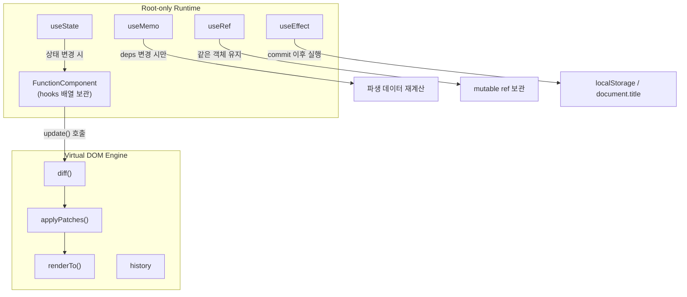
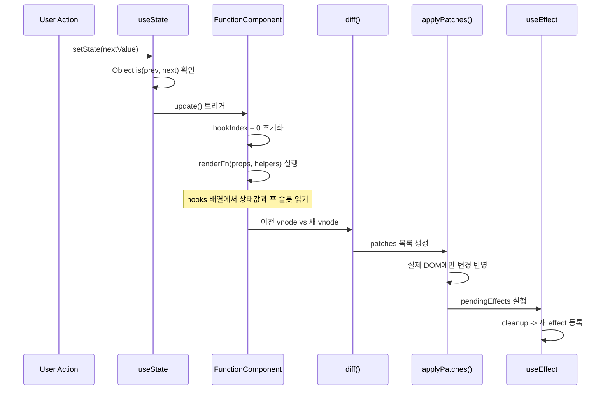

# mini-react

> Virtual DOM 엔진 위에 올린 루트 전용 React runtime - Component, State, Hooks를 직접 구현하며 학습하는 프로젝트

---

## 무엇을 만들었나

이번 과제의 목표는 React의 핵심 개념인 **Component, State, Hooks를 직접 구현**하고, 그 위에서 실제로 동작하는 웹 페이지를 만드는 것이었습니다.

기존에 만들었던 Virtual DOM → Diff → Patch 파이프라인 위에, 함수형 컴포넌트를 실행하고 상태와 Hook 정보를 관리하는 **내부 실행 로직**을 추가하는 방식으로 구현했습니다.

현재 runtime은 루트 컴포넌트 기준으로 `useState`, `useMemo`, `useRef`, `useEffect`를 지원하며, 이 Hook들이 Virtual DOM 엔진 위에서 어떻게 동작하는지 직접 따라가 볼 수 있습니다.

---

## 핵심 아이디어

함수형 컴포넌트를 그냥 호출하는 것이 아니라, **`FunctionComponent` 클래스로 감싸서 상태와 Hook 실행 정보를 직접 관리**합니다.

이 클래스는 크게 세 가지 역할을 합니다.

- **첫 번째**: `hooks` 배열로 state, memo, ref, effect 슬롯을 저장하는 것
- **두 번째**: `mount()`로 최초 렌더링하는 것
- **세 번째**: `update()`로 상태 변경 이후 다시 렌더링하는 것

```text
렌더 함수는 매번 다시 실행되지만,
상태값과 훅 슬롯은 함수 바깥의 hooks 배열에 저장되기 때문에 유지됩니다.
```

| 역할 | 방법 |
|------|------|
| Hook 슬롯 저장 | `hooks[]` 배열에 state / memo / ref / effect 정보 보관 |
| 최초 렌더 | `mount(container, initialProps)` |
| 상태 변경 후 재렌더 | `update(nextProps)` -> diff -> patch |
| 정리 | `unmount()` -> 모든 effect cleanup 실행 |

### 제약 조건 (의도적 설계)

- Hook과 State는 **루트 컴포넌트에서만** 사용 가능
- 자식 컴포넌트는 `(props) => vnode` 형태의 **stateless plain function**
- 상태는 모두 루트에서 관리하고, 자식은 화면 조각 렌더링만 담당

---

## 아키텍처

프로젝트는 두 레이어로 구성됩니다.

```text
┌─────────────────────────────────────────────┐
│              Root-only Runtime              │
│   FunctionComponent · mountRoot            │
│   useState · useMemo · useRef · useEffect  │
├─────────────────────────────────────────────┤
│             Virtual DOM Engine              │
│   domToVdom · vdomToDom · diff             │
│   applyPatches · renderTo · history        │
└─────────────────────────────────────────────┘
```



---

## 렌더 사이클

상태가 바뀌면 어떤 일이 일어나는지 한눈에 볼 수 있습니다.



---

## Runtime API

### `FunctionComponent`

루트 컴포넌트를 감싸는 클래스. 이 인스턴스가 직접 runtime 상태를 소유합니다.

```js
const Root = new FunctionComponent((props, { renderChild }) => {
  const [count, setCount] = useState(0);

  return elementNode("section", {}, [
    renderChild(Row, { label: "count", value: String(count) }),
  ]);
});
```

| 프로퍼티/메서드 | 역할 |
|----------------|------|
| `hooks` | state, memo, ref, effect 정보 저장 배열 |
| `hookIndex` | 렌더 중 현재 hook 위치 커서 |
| `pendingEffects` | commit 후 실행 대기 중인 effect 목록 |
| `mount(container, initialProps)` | 최초 렌더링 |
| `update(nextProps)` | 상태 변경 후 재렌더 |
| `unmount()` | effect cleanup 후 DOM 제거 |

### `mountRoot`

기존 사용성을 위한 얇은 wrapper입니다.

```js
const app = mountRoot(container, Root, { initialCount: 1 });
app.rerender();
app.setProps({ initialCount: 2 });
app.unmount();
```

---

## Hooks

### `useState`

```js
const [count, setCount] = useState(0);
setCount(prev => prev + 1); // updater 함수도 지원
```

- 값 또는 updater 함수를 받습니다.
- `Object.is(prev, next)`가 같으면 rerender를 생략합니다.

### `useMemo`

```js
const filteredPosts = useMemo(
  () => posts.filter(p => p.category === selected),
  [posts, selected]
);
```

- `{ value, deps }`를 캐시합니다.
- deps는 `Object.is` 기반 shallow compare를 사용합니다.
- 의존성이 바뀐 경우에만 계산을 다시 수행합니다.

### `useRef`

```js
const prevStateRef = useRef(null);
prevStateRef.current = posts;
```

- `{ current }` 객체를 반환합니다.
- 같은 Hook 슬롯에서는 같은 ref 객체를 유지합니다.
- `ref.current` 변경만으로는 rerender되지 않습니다.

### `useEffect`

```js
useEffect(() => {
  localStorage.setItem("posts", JSON.stringify(posts));
  return () => { /* cleanup */ };
}, [posts]);
```

- commit 이후 실행됩니다.
- deps 변경 시 이전 cleanup을 먼저 실행합니다.
- `unmount()` 때 모든 cleanup을 정리합니다.

---

## 데모

### `/runtime-demo.html` - 네이버 카페형 커뮤니티 서비스

mini-react로 구현한 메인 데모입니다.

| 기능 | 설명 |
|------|------|
| 로그인 / 로그아웃 | `isLoggedIn` 상태 변경 -> 레이아웃 전환 |
| 글쓰기 / 수정 | `posts` 상태 변경 -> diff -> patch |
| 좋아요 | `liked`, `likes` 변경 -> 목록·상세·통계 동시 갱신 |
| 검색 / 카테고리 / 정렬 | `useMemo`로 파생 데이터 캐싱 |
| 상태 추적 보조 | `useRef`로 이전 상태 참조 같은 mutable 값 유지 |
| 새로고침 유지 | `useEffect`로 `localStorage` 자동 저장 |

**상태 흐름 예시 - 좋아요 버튼 클릭:**

```text
클릭 -> posts[i].liked, likes 변경
     -> update() 실행
     -> 새 vnode 생성
     -> diff -> patch
     -> 목록 / 상세 패널 / 통계 동시 갱신  <- Lifting State Up
```

> 상태를 한 곳에 모으는 **Lifting State Up** 방식의 장점이 여기서 드러납니다.

### `/history-demo.html` - Diff / History Demo (Week 4)

편집 가능한 DOM 비교, patch 적용, history 이동을 확인할 수 있는 기존 데모입니다.

---

## 실행

```bash
npm install
npm run dev
```

Vite 주소를 연 뒤 아래 페이지를 확인하세요.

| 경로 | 내용 |
|------|------|
| `/` | 과제 허브 (Week 4 · Week 5 링크) |
| `/runtime-demo.html` | 커뮤니티 서비스 데모 |
| `/history-demo.html` | Diff / History 데모 |

---

## 테스트

```bash
npm test
```

diff, patch, history, runtime 관련 테스트가 포함되어 있습니다.

---

## 실제 React와의 차이

| 항목 | mini-react | React |
|------|-----------|-------|
| Hook 사용 범위 | 루트 컴포넌트만 | 모든 컴포넌트 |
| 자식 컴포넌트 상태 | ❌ (props only) | ✅ |
| `useRef` 지원 범위 | 루트 컴포넌트만 | 모든 컴포넌트 |
| Fiber / Scheduler | ❌ | ✅ |
| Context / Reducer | ❌ | ✅ |
| Batching | ❌ | ✅ |

학습용 구현이므로 **작고 설명 가능한 구조**를 우선했습니다.
